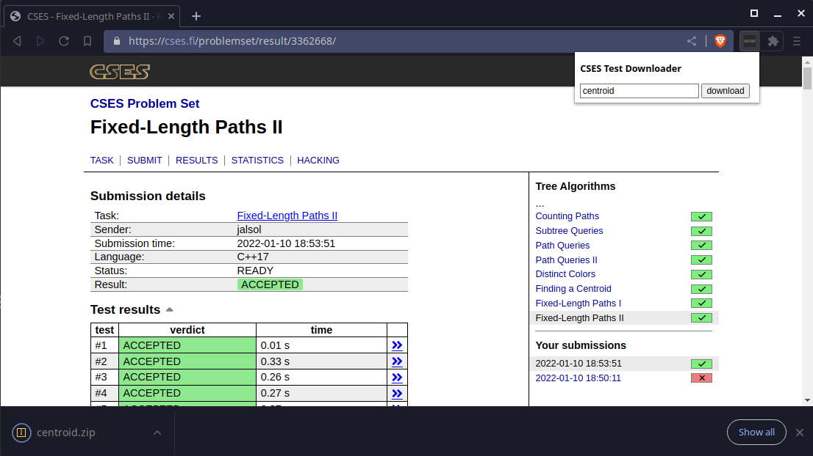

# CSES Test Downloader

This Chrome (sorry Firefox users) extension fetches test cases from your result
page and download them. Currently supports DMOJ and Themis test formats (if you
would like more, please consider a pull request).

I don't intend to create this extension in the first place.
[@winprn](https://github.com/winprn) and
[@hoangquocvietuet](https://github.com/hoangquocvietuet) told me to make one, so here it is.
This is also my first attempt at creating a browser extension, please bear with
me if it sucks.

# Dependencies

- [JSZip](https://github.com/Stuk/jszip) and [JSZipUtils](https://github.com/Stuk/jszip-utils)
- [FileSaver](https://github.com/eligrey/FileSaver.js)

# Installation

## From .crx file

- Go to [Release](https://github.com/jalsol/cses-test-downloader/releases) and install the .crx file
- Go to `chrome://extensions` and enable Developer mode
- Drag the installed .crx file to the browser

## From source

- Clone this repository (or download as zip then extract)
- Go to `chrome://extensions` and enable Developer mode
- Select `Load unpacked` then select the directory

# Usage

- Click on the extension
- Enter the desired task name (optional, the default name is the task's ID)
- Choose the test format
- Click on `download` and wait
